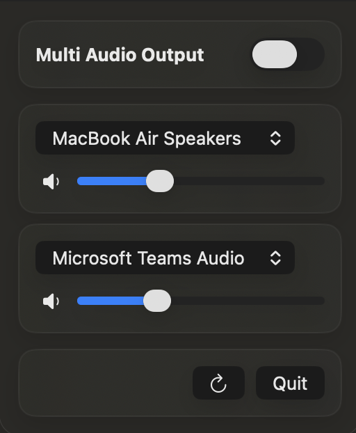

# &nbsp;&nbsp;Duophonic

Listening together matters, because sharing is caring.

> In synthesizers, Duophonic means the ability to play two notes at once.
Duophonic for Mac lets you do the same with sound — listening together.

Easily send macOS audio to two outputs at once — perfect for parties, demos, or running headphones and speakers together. Lightweight, system-aware, and built with Core Audio so everything stays in sync.

## Quick Download & Install

One-liner for lazy folks:

```bash
curl -sSLO https://github.com/juri1212/Duophonic/releases/latest/download/Duophonic.zip && \
unzip -q Duophonic.zip && \
rm -f Duophonic.zip && \
mv "Duophonic.app" /Applications/ && \
open /Applications/Duophonic.app
```
> Note: You may be prompted to allow the app in System Settings → Privacy & Security.

## Features

- Simple UI to create a system-wide aggregate output that plays to two devices at once.
- Choose a primary and secondary output device from the detected hardware list.
- Per-device volume sliders (for devices that support software volume control).
- Automatic drift compensation for the secondary device when the aggregate is created.
- Safe lifecycle handling: the app restores the previous default output and destroys the aggregate when disabled or on quit.
- Quick refresh of device list and auto-selection of the first two outputs.
- Ideal for **listening with two pairs of AirPods** (or any two Bluetooth headsets). Create an aggregate output, set each AirPod pair as one of the outputs, and enjoy synced playback between both sets.

<div align="center">
	
</div>

## Usage

- Open the app. It lists all detected output-capable audio devices (internal speakers, headphones, external DACs, Bluetooth devices, etc.).
- Pick a `Primary` device and a `Secondary` device.
- Use the sliders to set per-device volumes (sliders are disabled if the device does not expose a software volume control).
- Flip the toggle in the top-right to enable multi-output.
- To stop multi-output, flip the toggle off or quit the app — the previous default output will be restored.

## Notes & Limitations

- The aggregate device is created as a temporary, app-managed device and is removed when disabled. If the app is terminated unexpectedly the aggregate may remain; you can remove it from System Settings → Sound if needed.
- Some devices (notably certain Bluetooth or USB audio interfaces) may not expose software volume controls; in that case the slider will be disabled and you'll need to adjust hardware volume on the device itself.

## How It Works

The app uses Core Audio APIs to create a temporary aggregate device that contains two selected output devices. The selected primary device is treated as the master (no drift compensation) while the secondary device is added with drift compensation enabled so both outputs stay in sync.

When enabled the app will attempt to set the new aggregate as both the default output and the default system output. When you disable the feature (or quit the app) it will attempt to restore the previous default output and remove the aggregate device it created.

## Step by step Installation

- Download the latest release and unzip it with a single command:

```bash
curl -sSLO https://github.com/juri1212/Duophonic/releases/latest/download/Duophonic.zip
unzip Duophonic.zip
rm -f Duophonic.zip
```

- Move the app to `/Applications` and open it:

```bash
mv "Duophonic.app" /Applications/
open /Applications/Duophonic.app
```

> Note: You may be prompted to allow the app in System Settings → Privacy & Security. Approve any prompts and, if necessary, grant the app permissions to access audio devices.

## Troubleshooting

- If macOS prevents opening the app because it's from an unidentified developer, Control-click the app in Finder and choose `Open`, then confirm.
- If the app needs to access audio devices or system settings, go to `System Settings` → `Privacy & Security` and allow the requested permissions.
- If the downloaded file is different than the example above, replace the file name in the `curl` command with the correct file name shown on the release page.

## Uninstall

To remove the app and its preferences:

```bash
rm -rf /Applications/Duophonic.app
rm -rf ~/Library/Preferences/juri1212.Duophonic.plist
```
